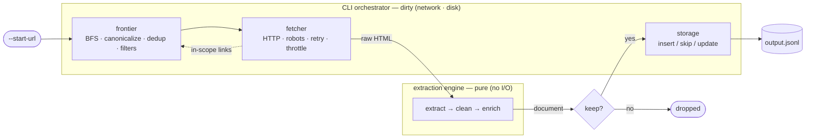

# extractor-engine

A small, production-minded scraping pipeline that crawls a single public website
and turns it into a collection of clean, schema-consistent, metadata-rich JSON
documents — ready to feed an AI workflow (RAG, search, fine-tuning, analytics)
**without re-processing**.

It crawls from a seed URL, extracts and cleans the main content of each page
(dropping navigation, headers, sidebars, and footers), enriches every record with
quality signals and metadata, and writes the result as newline-delimited JSON.

## Quickstart

```bash
# 1. Install (editable, from the app/ package)
pip install -e ./app

# 2. Run
scrape_site --start-url=https://books.toscrape.com/ --max-pages=100 --output=output.jsonl

# 3. Look at the result — one JSON document per line
head -n 1 output.jsonl
```

Optional developer install (tests, linting, types):

```bash
pip install -e "./app[dev]"
make -C app test
```

## What it produces

One **document object** per kept page, serialized as one line of JSONL:

```json
{
  "id": "5f2b9c1e-7a4d-5e6f-8b9a-0c1d2e3f4a5b",
  "url": "https://books.toscrape.com/catalogue/a-light-in-the-attic_1000/index.html",
  "title": "A Light in the Attic",
  "body_text": "A Light in the Attic. It's hard to imagine a world without ...",
  "tags": ["Books", "Poetry"],
  "published_at": null,
  "modified_at": "2023-02-08T21:02:32Z",
  "fetched_at": "2026-06-14T12:00:00Z",
  "content_hash": "9b74c9897bac770ffc029102a200c5de...",
  "signals": {
    "word_count": 187,
    "char_count": 1124,
    "language": "en",
    "content_type": "product_page",
    "is_mostly_code": false
  },
  "extra": {}
}
```

Every field answers a concrete downstream decision. The full schema and field
reference is in [docs/data-model.md](docs/data-model.md).

## How it works



The extraction core is a **pure library** (no I/O); the crawler is the **dirty
orchestration** around it. That boundary is reflected directly in the directory
layout, which keeps the quality-critical code testable on static fixtures with no
network. See [docs/architecture.md](docs/architecture.md).

## Project layout

```
.
├── README.md
├── docs/                      Design & reference documentation
├── examples/                  Sample output records (sample_output.jsonl)
├── tests/                     Unit, validation, golden-file, and integration tests
└── app/
    ├── pyproject.toml         Package metadata + the `scrape_site` entry point
    ├── Makefile               install / test / lint / typecheck / schema / run
    ├── Dockerfile
    ├── .env.example
    └── extractor_engine/
        ├── engine/            PURE — models, extractor, cleaner, enricher
        ├── crawl/             DIRTY — fetcher, frontier, crawler
        ├── storage/           JSONL (default) + optional Postgres
        ├── config.py
        ├── cli.py
        └── analytics.py
```

## Configuration

Configured by CLI flags and environment variables, resolved **CLI flag > env var
> default**. Key flags: `--start-url` (required), `--max-pages` (100),
`--max-depth` (5), `--output` (`output.jsonl`), `--delay` (0.5s), `--include` /
`--exclude` (path regex), `--user-agent`, `--ignore-robots`. The default run
needs **zero infrastructure**; optional Postgres / object-storage backends
activate only when their environment variables are set. Full reference:
[docs/configuration.md](docs/configuration.md).

## Site chosen and why

The crawler targets **books.toscrape.com** — a sandbox published explicitly for
scraping practice, so there's no robots/terms/legal ambiguity to work around. It
also exercises the parts that matter: real internal link structure (catalogue
pagination and category pages to crawl) and many content-leaf product pages with
genuine boilerplate — nav, breadcrumb, sidebar, footer — to strip, so extraction,
content-type classification, and metadata enrichment all get a real workout. The
pipeline is built generically (no site-specific selectors), so the same code
generalizes to other sites; books.toscrape is the test bed, not a hardcoded target.

## Design at a glance

- **Generic, not site-specific, extraction** — a layered, self-validating
  extractor (`validate-then-cascade`) that survives markup changes instead of
  hardcoded selectors. [docs/extraction.md](docs/extraction.md)
- **Buy the workhorse, own the robustness** — a proven extraction library does
  the heavy lifting; the in-house contribution is auditing its output and
  cascading to fallbacks when it misfires.
- **JSONL deliverable, optional state store** — the output is a plain JSONL file;
  idempotency (insert / skip / update keyed on a stable id) means re-runs don't
  duplicate records. [docs/storage-and-idempotency.md](docs/storage-and-idempotency.md)
- **Two filters** — *scope* (what to crawl) is separate from *keep* (what to
  emit), so listing pages can be followed for links without polluting the corpus.
  [docs/crawling.md](docs/crawling.md)

The full rationale for each critical decision — context, alternatives, and
trade-offs — is in [docs/design-decisions.md](docs/design-decisions.md).

## Documentation

| Document | Covers |
|---|---|
| [architecture.md](docs/architecture.md) | System shape, data flow, the pure/dirty boundary |
| [data-model.md](docs/data-model.md) | The document object: schema and field reference |
| [crawling.md](docs/crawling.md) | Frontier, canonicalization, filters, politeness, errors |
| [extraction.md](docs/extraction.md) | Main-content cascade and cleaning |
| [enrichment.md](docs/enrichment.md) | Signals, tags, dates, content-type, quality gate |
| [storage-and-idempotency.md](docs/storage-and-idempotency.md) | Output format and idempotency |
| [configuration.md](docs/configuration.md) | Flags, env vars, precedence |
| [testing.md](docs/testing.md) | Test strategy |
| [design-decisions.md](docs/design-decisions.md) | The key design decisions and why |
| [future-work.md](docs/future-work.md) | Production evolution and deliberate v1 boundaries |

## Testing

```bash
make -C app test
```

Pure functions are tested table-driven; the extractor's robustness is verified by
feeding it navigation-heavy and too-short inputs and asserting it rejects and
cascades; a golden-file test pins the whole transform on real saved pages; and an
integration test asserts a second run produces **zero new records**. See
[docs/testing.md](docs/testing.md).
