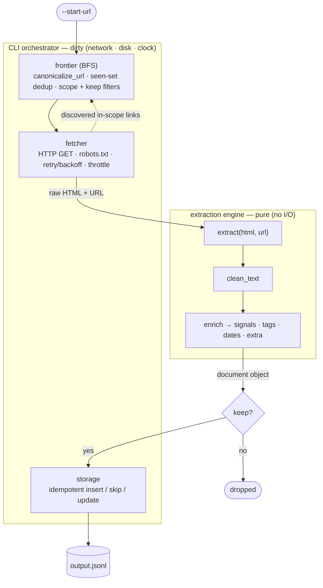

# Architecture

This document describes the shape of the system: the stages a page passes
through, the components that own each stage, and the single boundary that the
whole design is organized around — the split between a **pure extraction core**
and the **dirty orchestration** that surrounds it. The goal of the architecture
is to make the side-effecting parts of the system small, contained, and easy to
mock, so that the part that actually determines output quality — extraction and
enrichment — can be tested exhaustively on static fixtures with no network.

## One data contract

Every stage of the pipeline produces, enriches, or persists the same object: the
**document object** (see [data-model.md](data-model.md)). It is the currency of
the system. Stages do not pass around bespoke tuples or stage-specific structs;
they hand this one object along. That single contract is what keeps the stage
interfaces thin and lets each stage be reasoned about in isolation.

Per-stage signatures, expressed informally:

| Stage | Signature | Side effects |
|---|---|---|
| fetch | `url -> response` | Network |
| extract | `(html, url) -> (title, main_html)` | None (pure) |
| enrich | `doc -> doc` | None (pure) |
| store | `doc -> JSONL` | Disk |
| crawl | `(seed, options) -> drives the above` | Network, disk, clock |

## Pipeline data flow



The crawler drives the loop. For each URL it pops from the frontier, it fetches
the page, hands the raw HTML and URL to the engine, receives a document object
back, applies the keep decision, persists kept documents idempotently, and feeds
newly discovered in-scope links back into the frontier. The loop ends when the
frontier is empty or a bound (`--max-pages` / `--max-depth`) is hit.

## Components and responsibilities

The package `extractor_engine` is divided into three internal areas plus a thin
glue layer. The directory tree is deliberately a map of the pure-vs-dirty
boundary — the architecture documents itself.

```
extractor_engine/
  engine/          PURE — no I/O, no clock, no network
    models.py        Document, Signals, ContentType (the contract)
    extractor.py     the layered validate-then-cascade main-content extractor
    cleaner.py       clean_text() — the ordered cleaning pipeline
    enricher.py      signals, tags, dates, content_type, code detection, quality gate
  crawl/           DIRTY — network and crawl state
    fetcher.py       HTTP, robots.txt, retry/backoff, throttle, User-Agent, Content-Type guard
    frontier.py      BFS queue, bounds, canonicalize_url(), seen-set, scope + keep filters
    crawler.py       the orchestration loop
  storage/         persistence
    base.py          the Store protocol
    jsonl.py         default zero-infra JSONL store (insert/skip/update, atomic write)
    postgres.py      optional Postgres backend (UPSERT on id)
  config.py        settings (CLI > env > default)
  cli.py           the scrape_site entry point; the only place logging is configured
  analytics.py     reads JSONL → corpus statistics (doubles as QA)
```

| Area | Responsibility | Touches the outside world? |
|---|---|---|
| `engine/` | Parse and transform: HTML + URL in, a document object out. Knows nothing about crawling, files, or time. | No |
| `crawl/` | Discover URLs and fetch bytes. The only network layer. | Yes |
| `storage/` | Persist documents idempotently; select an optional backend. | Yes (disk / DB) |
| glue | Wire flags and env into settings, run the loop, configure logging, compute analytics. | Yes |

## The pure-core vs dirty-orchestration boundary

The engine is a **pure library**: `extract(html, url)`, `clean_text(html)`, and
`enrich(doc)` are plain functions with no I/O. The CLI orchestrator imports the
engine directly and calls it once per page. The engine has no awareness of HTTP,
files, the frontier, or the clock.

Two properties motivate this boundary:

1. **Testability.** Extraction quality is the thing that determines whether the
   output is usable, and it is the hardest part to get right. By keeping it pure,
   the entire engine is unit-testable on saved HTML fixtures with zero network.
   Fetching — the one genuinely dirty layer — is mocked exactly once, and
   everything downstream of it runs deterministically. See [testing.md](testing.md).

2. **Evolvability.** Because the engine is already a clean library with a single
   data contract, new entry points are cheap to add without touching extraction
   logic. A network service that exposes the engine over HTTP, for example, is a
   thin adapter rather than a rewrite. See [future-work.md](future-work.md).

The boundary-finding heuristic the layout follows: quarantine I/O from pure
logic, group modules by their axis of change, locate the currency object, and
cut the interfaces at its hand-offs — keeping each interface thin.

## What this version intentionally is not

There is **no web server** in this version. The deliverable is a CLI/function, so
an HTTP service is treated as Future Work — and is cheap to add precisely because
the engine is already pure. There is no JavaScript rendering (static HTML only),
no authentication handling, and no cross-source deduplication. These are
deliberate boundaries, documented in [future-work.md](future-work.md).
