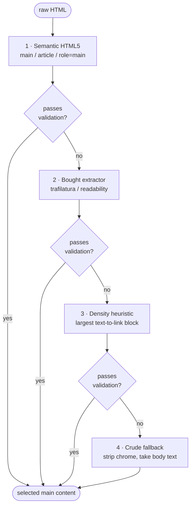

# Extraction and cleaning

This document describes how the pipeline turns a page of raw HTML into clean
`body_text` and a resolved `title` — the part of the system that most directly
determines whether the output is usable. The design goal is **robustness to site
changes**: rather than hand-tuned selectors for one site's exact markup, the
engine uses a generic, layered extractor that validates its own output and falls
through when a layer misfires. Everything here is pure: it takes HTML and a URL
and returns text, with no I/O.

## Why generic, not site-specific

Main content could be extracted with hardcoded CSS selectors targeting the
sandbox site's exact HTML. That would be flawless on that one site and a **full
rewrite for any second site** — and the moment the site's markup drifts, it
breaks. A generic, site-agnostic approach is fuzzier on any single page but is
built once, survives markup changes, and generalizes to sites the code has never
seen. Because dirty `body_text` silently poisons every downstream embedding —
and a consumer cannot tell which records to distrust — robustness is worth more
here than a perfect fit to one layout.

This is the single most consequential choice in the system; its full rationale is
in [design-decisions.md](design-decisions.md).

## Buy the workhorse, own the robustness

The extractor does **not** hand-roll a main-content algorithm. It uses a proven,
maintained extraction library (trafilatura, with a readability-style approach) as
its workhorse layer. Re-implementing that algorithm would be reinventing a solved
problem. The contribution that matters — and the part built in-house — is the
**robustness layer** wrapped around the library: validating its output and
cascading to fallbacks when it misfires.

## The layered cascade

Extraction is a cascade of four layers, tried in order. The first layer whose
output **passes validation** wins.



The first layer whose output passes validation wins. Layer 4 is a guaranteed
floor: it always returns *something*, so the extractor never raises and never
returns nothing for a page that has any body at all.

## Validate-then-cascade

The cascade is driven by **validation**, not by exceptions. The engine does not
"try until something stops throwing"; it **validates each layer's output before
trusting it**, and falls through on failure. This validation is the critical
robustness contribution.

The validation rules target the two ways a content extractor fails:

| Failure mode | Symptom | Rejection rule |
|---|---|---|
| **Over-extraction** | The layer pulled in navigation, sidebar, or footer along with the content. | Reject if **link density is too high** (default: links make up more than 40% of the block). |
| **Under-extraction** | The layer bailed early and returned a fragment. | Reject if the output is **too short** (default: fewer than 25 words) relative to the page. |

A layer's output is accepted only if it clears both checks. If no layer's output
passes, the engine returns layer 4 (the crude fallback) so that a result is
always produced. The thresholds are configurable.

## The cleaning pipeline

Once a main block is selected, it is cleaned in a **fixed order** — the order
matters, because chrome must be removed *before* text is grabbed, or its text
leaks into `body_text`.

1. **Drop non-content elements:** `<script>`, `<style>`, `<noscript>`.
2. **Drop chrome before grabbing text:** `<nav>`, `<header>`, `<footer>`,
   `<aside>`, plus non-content UI widgets flagged by ARIA role (`alert`,
   `dialog`, `banner`) or conventional class names (`alert`, `banner`, `cookie`,
   `consent`, `promo`, …). Doing this first is what keeps menu items, footer
   links, and cookie/notice banners out of the body. The match is on a generic
   *category* of furniture, never on any one site's wording.
3. **Strip remaining tags** to plain text.
4. **Decode HTML entities** (e.g. `&amp;` → `&`).
5. **Normalize whitespace:** collapse runs of spaces; collapse three-or-more
   consecutive newlines down to two; trim each line.
6. **Drop boilerplate lines:** cookie banners, "skip to content" links, lone
   copyright lines.
7. **Trim a trailing related-content block:** a "recently viewed" / "you may also
   like" / "related products" heading that appears *after enough real content*
   (a word-count gate, not a line position, so a large carousel can't skew it)
   drops that heading and everything after it. This catches related-content
   carousels that survive into the extraction library's flattened text, where
   tag/class removal can't reach them. The word gate guarantees main content is
   never cut.

The result is `body_text`: the page's main prose, with navigation, header,
sidebar, footer, and trailing related-content widgets removed, entities decoded,
and whitespace normalized.

**Known limitation.** When a source page embeds the *same* description twice in
one block — e.g. a truncated teaser immediately followed by the full text, with
the teaser cut mid-word so it glues onto the full copy — that intra-block
duplication can survive. A safe, generic de-duplicator cannot cleanly separate
the glued copies, and a site-specific rule would violate the generic-extraction
principle. The production fix is to extract the main-content *node* (so structural
de-duplication applies) or to de-duplicate at chunk boundaries downstream — see
[future-work.md](future-work.md).

## Title resolution

`title` is resolved by a **precedence cascade** — the first non-empty source
wins:

```
og:title  →  <h1>  →  trafilatura title  →  <title> (strip " | Site")  →  slug-derived  →  ""
```

- `og:title` is preferred because it is the page's own declared title.
- `<title>` has any trailing site suffix (`" | Site Name"`) stripped.
- The library's parsed title is folded in as one source in this chain (see the
  decoupling note below).
- **Slug-derived** is a best-effort last resort: take the URL slug, strip a
  trailing `_<id>` suffix, replace `-`/`_` with spaces, and title-case it. On a
  non-slug URL this yields junk, so it falls through to `""`.
- `""` is the final fallback — `title` is always a string, never null.

## Metadata is decoupled from the winning body layer

The extraction library is invoked once per page, and its parsed metadata (title,
date, tags, language) is taken from that single parse **regardless of which body
layer wins** the validate-then-cascade. Body selection and metadata extraction
are separate decisions off the same parse. This keeps the code DRY (the library
is parsed once, not once per concern) and robust (metadata is still available even
when the body falls through to a non-library layer). The metadata sources and how
they are merged are detailed in [enrichment.md](enrichment.md).
